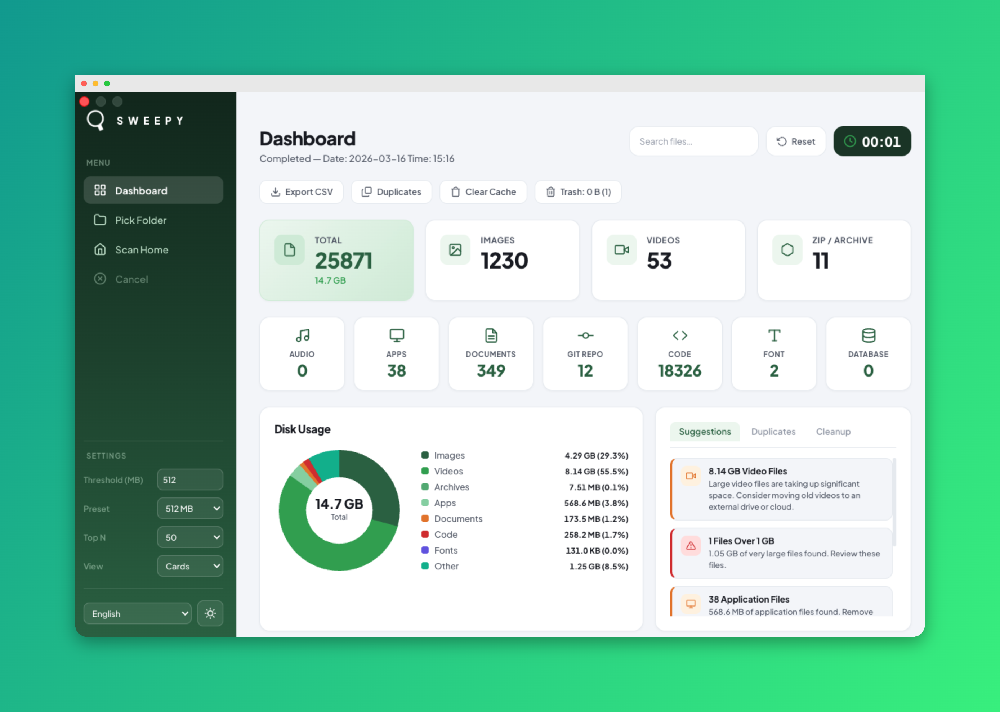

# Sweepy – Disk Analyzer for macOS

A lightweight, fast, and beautiful disk analysis tool that lives in your menubar. Sweepy scans your directories and gives you a clear picture of what's eating up your disk space.

## Features

- Recursive directory scanning with real-time progress updates
- File categorization by type: images, videos, audio, archives, documents, apps, code, fonts, databases, git repos
- Configurable large file threshold (MB) with quick presets
- Top N largest files listing
- Doughnut chart for disk usage breakdown by file type
- Treemap visualization showing proportional space usage per category
- Distribution summary with size buckets, age buckets, and top folders
- Duplicate file detection using size grouping and MD5 hash verification
- Cache and temp file detection (.DS_Store, node_modules, .cache, __pycache__, .tmp, etc.)
- One-click cache cleanup with confirmation dialog
- Empty folder detection
- Trash size display and one-click empty via native macOS Finder integration
- Smart cleanup suggestions based on scan results with severity levels
- Drag & drop any folder to instantly scan it
- CSV export for scan results
- Scan history with last 10 scans and diff indicators between scans
- Configurable automatic scheduled scanning
- Keyboard shortcuts: ⌘+O pick folder, ⌘+H scan home, Esc cancel
- Instant file search and filtering
- One-click reset to clear all results
- Light and dark mode with green-gradient dashboard theme
- Turkish and English language support with instant switching
- Menubar app — stays out of your way until needed
- Draggable custom titlebar with native macOS traffic lights
- Responsive layout from 750px to 2048px
- Card and list view toggle for file listings
- Click any file to reveal in Finder, delete with confirmation
- Native macOS notifications on scan completion

## Installation

1. Download **Sweepy-1.0.0-arm64.dmg**
2. Open the DMG and drag **Sweepy** to your **Applications** folder
3. On first launch, right-click the app and select **Open** (required for unsigned apps)
4. Sweepy will appear in your menubar — click the icon to open

> **Tip:** For full disk scanning, go to **System Settings → Privacy & Security → Full Disk Access** and add Sweepy.

## System Requirements

- macOS 11 (Big Sur) or later
- Apple Silicon (arm64)

---

Made with care for a cleaner Mac.
